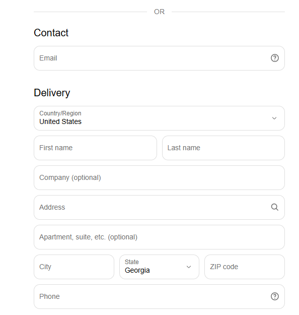

# Bearcrawl

### How to Use
## 1. Configure Bearcrawl

Before running a checkout, open the configuration file:

```%USERPROFILE%\Documents\bearcrawl\config.json```


Set up your checkout information in the configuration file. <strong>Bearcrawl</strong> uses these values to automatically fill in the corresponding checkout fields when needed.


## 2. Start Bearcrawl

Once your configuration is set up, run:

Bearcrawl.exe
## 3. Run the Checkout

Follow the prompts in <strong>Bearcrawl</strong> to begin the checkout process.

<strong>Bearcrawl</strong> will use the information from config.json to fill in the checkout form automatically.

For products with a size option, <strong>Bearcrawl</strong> uses the configured preferred size. If a product does not have a size option, <strong>Bearcrawl</strong> selects the first available variant.

## 4. Complete Checkout Manually

When the checkout form is ready, the browser will remain open for you to review and complete the checkout manually.

<strong>Bearcrawl</strong> does <strong>NOT</strong> click Pay Now...yet

## Build / Download

You have two options to use <strong>Bearcrawl</strong> on Windows:

### Option 1 — Download the latest release

The easiest option is to download the latest Windows release from the project's Releases page.

The release includes the packaged application, so the target computer does not need Python, Playwright, or a separately installed browser.

### Option 2 — Build from source

To build <strong>Bearcrawl</strong> yourself, you need Windows and uv installed.

From the project directory, run:

```powershell
.\build.ps1
```